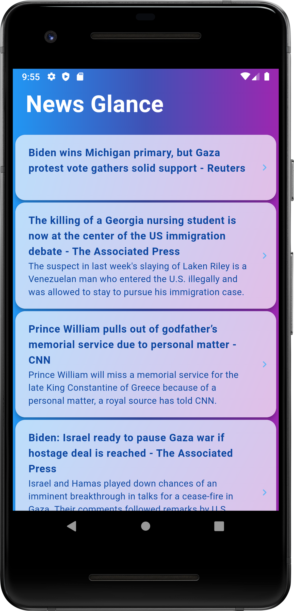
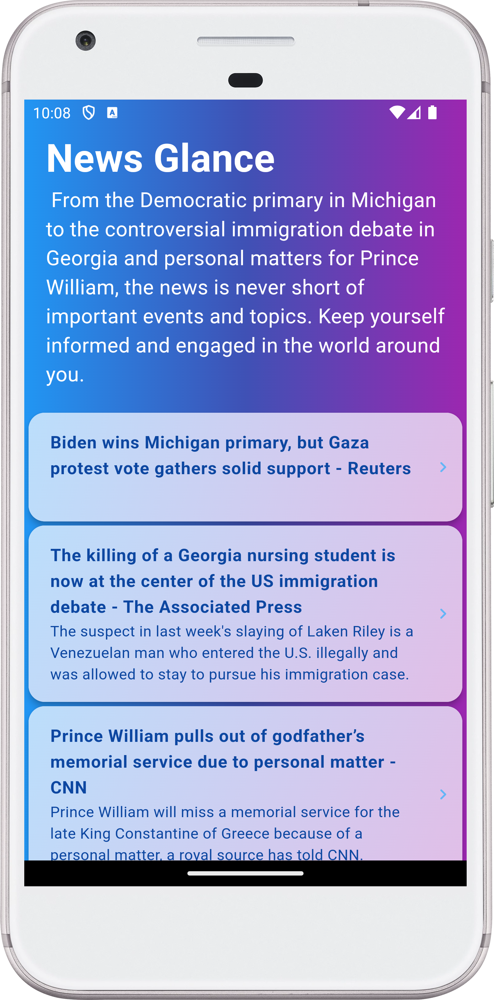
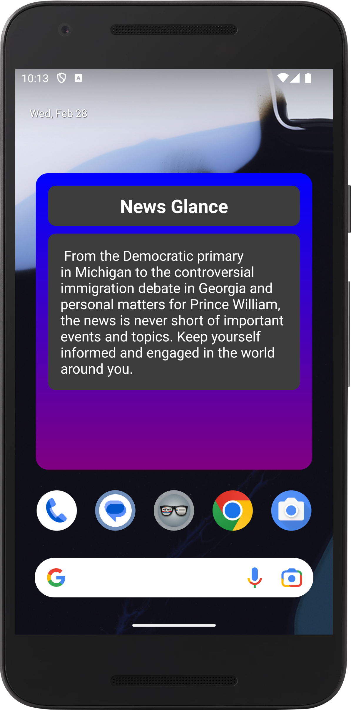

[](https://stand-with-ukraine.pp.ua)
[](https://appdistribution.firebase.dev/i/84a5fda691af5a9b)
[](https://play.google.com/store/apps/details?id=com.turskyi.news_glance)
[](https://github.com/flutter/flutter/wiki/Style-guide-for-Flutter-repo)
[](https://pub.dev/packages/flutter_lints)


# News Glance

News Glance is a flutter app that lets you access the latest news and insights
from your home screen widget. It uses AI to generate a conclusion from the news
headlines and allows you to view and share the articles.

## PROJECT SPECIFICATION

• Programming language: [Dart](https://dart.dev/);

• SDK: [Flutter](https://flutter.dev/);

• Interface: [Flutter](https://flutter.dev/docs/development/ui);

• Version control system: [Git](https://git-scm.com);

• Git Hosting Service: [GitHub](https://github.com);

• RESTful API: [News API](https://newsapi.org);

• CI/CD: [GitHub Actions](https://docs.github.com/en/actions) is used to deliver
new Android Package (APK) to
[Firebase App Distribution](https://firebase.google.com/docs/app-distribution)
after every push to any other than the **master**branch,
[Codemagic](https://codemagic.io/start/) is used to deliver new release app
bundle to **Google Play** after every merge (push) to **master** branch;

• State management approach: [BLoC](https://bloclibrary.dev);

• App testing platforms:
[Firebase App Distribution](https://appdistribution.firebase.dev/i/84a5fda691af5a9b);

**Code Readability:** code is easily readable with no unnecessary blank lines,
no unused variables or methods, and no commented-out code, all variables,
methods, and resource IDs are descriptively named such that another developer
reading the code can easily understand their function.

# Getting Started

## To create generated files, run:

```
dart run build_runner clean
dart run build_runner build --delete-conflicting-outputs
```

## Screenshots:

<!--suppress CheckImageSize -->




## Screen Recording:


## Credits

This project is based on the codelab
[Adding a Home Screen widget to your Flutter App](https://codelabs.developers.google.com/flutter-home-screen-widgets)
by Leigha Jarett and Eric Windmill.

## Download

<a href="https://play.google.com/store/apps/details?id=com.turskyi.news_glance" target="_blank">

</a>
